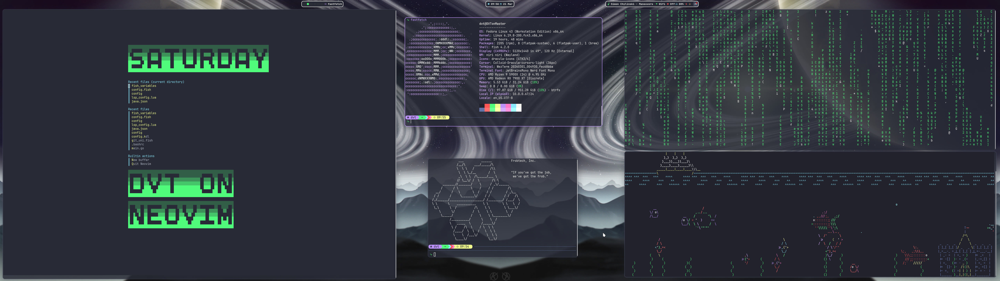

# Configuration files

The repo for my configuration files, all managed using this [guide](https://www.atlassian.com/git/tutorials/dotfiles).



## Index

- [Overview](#overview)
- [Fedora Post-Install](#fedora-post-install)
- [Icons and Mouse Cursors](#icons-and-mouse-cursors)
- [Themes](#themes)
- [BtrFS Snapshot System](.other_dotfiles_stuff/README.md#btrfs-snapshot-system)

## Overview

I use [Fedora](https://www.fedoraproject.org) as my Linux distro of choice.
Mainly, I just want something that works, and won't break (ideally ever).
I use the scrollable-tilling window manager  [Niri](https://github.com/niri-wm/niri).
My workflow is centered around the terminal, for which [Wezterm](https://wezterm.org/index.html) is my terminal of choice.
As my general text editor and programming IDE (or PDE), I use [Neovim](https://neovim.io).
For the web browser, I use [Zen](https://zen-browser.app).
For university and all documents, I use [Typst](https://typst.app) to write documents, and [Zathura](https://pwmt.org/projects/zathura) as my PDF viewer.

## Fedora Post-Install

1. Follow the [Fedora Post Install Guide](https://github.com/devangshekhawat/Fedora-44-Post-Install-Guide)
    - This will setup RPM Fusion and Terra repos, firmware, flatpak, appimages, Nvidia (if needed), media codecs and HW acceleration.

2. Install dotfiles

```bash
sudo dnf install -y python git
git clone --bare https://github.com/diego-velez/.files.git $HOME/.files
alias config='git --git-dir=$HOME/.files/ --work-tree=$HOME'
config checkout -f
config config --local status.showUntrackedFiles no
```

3. Add repos for programs

```bash
sudo dnf copr enable wezfurlong/wezterm-nightly
sudo dnf copr enable jdxcode/mise
sudo dnf copr enable atim/starship
sudo dnf copr enable dejan/lazygit
sudo dnf config-manager addrepo --from-repofile https://download.docker.com/linux/fedora/docker-ce.repo
```

4. Install DNF programs

```bash
sudo dnf install niri wezterm fish starship mise zoxide atuin lsb_release fortune vim eza bat gcc clang fd rhythmbox thunar btop quickshell mako lazygit rustup fastfetch asciiquarium cmatrix snapper zathura zathura-pdf-mupdf docker-ce docker-ce-cli containerd.io docker-buildx-plugin docker-compose-plugin swayidle chromium wl-clipboard clipman fuzzel
```

5. Install flatpak programs

```bash
flatpak install com.github.tchx84.Flatseal org.keepassxc.KeePassXC org.ferdium.Ferdium it.mijorus.gearlever org.localsend.localsend_app io.github.Qalculate
```

6. Install Homebrew and programs

```bash
/bin/bash -c "$(curl -fsSL https://raw.githubusercontent.com/Homebrew/install/HEAD/install.sh)"
brew install jesseduffield/lazydocker/lazydocker pipes-sh typst
```

7. Setups

```bash
mise install # Install all global mise tools as specified in .config/mise
rustup-init # Install rustup and rust toolchains
sudo systemctl enable --now docker # Enable the docker engine
sudo usermod -a -G docker dvt # You will need to atleast log-out and log back in to see the change

# These systemd service files are part of the dotfiles, and reside in ~/.config/systemd/user
sudo systemctl daemon-reload
systemctl --user add-wants niri.service mako.service # Notification service
systemctl --user add-wants niri.service swayidle.service # Idle service

# Enable snapper for Btrfs, it automatically creates a snapshot every week, and maintains a max of 3 snapshots at a time
# Follows https://github.com/diego-velez/.files/blob/main/.other_dotfiles_stuff/README.md#btrfs-snapshot-system
sudo snapper -c dvt create-config /
systemctl --user enable --now snapper-weekly@dvt.timer
cat << 'EOF' | sudo tee /etc/snapper/configs/dvt > /dev/null
# subvolume to snapshot
SUBVOLUME="/"

# filesystem type
FSTYPE="btrfs"

# fraction or absolute size of the filesystems space the snapshots may use
SPACE_LIMIT="0.2"

# fraction or absolute size of the filesystems space that should be free
FREE_LIMIT="0.2"


# users and groups allowed to work with config
ALLOW_USERS="dvt"
ALLOW_GROUPS=""

# sync users and groups from ALLOW_USERS and ALLOW_GROUPS to .snapshots
# directory
SYNC_ACL="yes"


# start comparing pre- and post-snapshot in background after creating
# post-snapshot
BACKGROUND_COMPARISON="yes"


# run daily number cleanup
NUMBER_CLEANUP="yes"

# limit for number cleanup
NUMBER_MIN_AGE="0"
NUMBER_LIMIT="3"
NUMBER_LIMIT_IMPORTANT="1"


# create hourly snapshots
TIMELINE_CREATE="no"

# cleanup hourly snapshots after some time
TIMELINE_CLEANUP="no"

# cleanup empty pre-post-pairs
EMPTY_PRE_POST_CLEANUP="yes"

QGROUP="1/0"
EOF
```

8. Install Neovim

```bash
cargo install --git https://github.com/MordechaiHadad/bob.git # I use bob to manage Neovim installations
cargo install --locked tree-sitter-cli # I use treesitter for Neovim syntax highlighting and parsing
bob use latest
```

9. Install Zen browser

```bash
wget https://github.com/zen-browser/desktop/releases/latest/download/zen.linux-x86_64.tar.xz
tar -xf zen.linux-x86_64.tar.xz -C ~/.local/bin
rm zen.linux-x86_64.tar.xz
```

10. Reboot

## Icons and Mouse Cursors

User-wide directory: `~/.icons`

System-wide icons directory: `/usr/share/icons`

## Themes

User-wide directory: `~/.themes`

System-wide themes directory: `/usr/share/themes`
